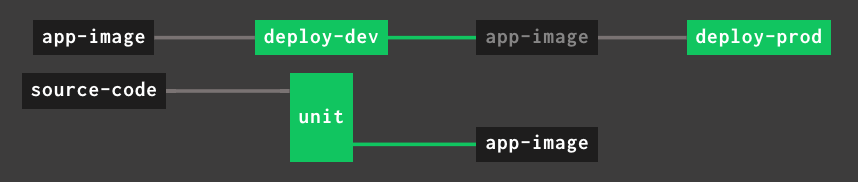

# Concourse kpack Resource 

Use a [kpack](https://github.com/pivotal/kpack) image in a concourse pipeline naturally.

## Installing

The recommended method to use this resource is with resource_types in the pipeline config as follows:

```yaml
---
resource_types:
- name: kpack-image
  type: registry-image
  source:
    repository: gcr.io/cf-build-service-public/concourse-kpack-resource
```

## Source configuration

Each resource corresponds to a kpack image resource in an kubernetes cluster

```yaml
resources:
- name: order-service-image
  type: kpack-image
  source:
    image: "some-existing-image-name"
    namespace: "some-namespace"
    
    ## configuration to access cluster. Described below.
```

* `image`: *Required string.*

  The name of a [kpack image resource](https://github.com/pivotal/kpack/blob/master/docs/image.md). 

* `namespace`: *Required string.*

  The namespace of the kpack image resource.
  

### Connecting to a gke cluster

```yaml
resources:
- name: order-service-image
  type: kpack-image
  source:
    image: "some-existing-image-name"
    namespace: "some-namespace"
    
    gke:
      json_key: ((service-account-key))
      kubeconfig: ((kubeconfig))
```

* `json_key`: *Required string.*

  The contents of a service account json key. The service account key must have access to the configured image and namespace.

* `kubeconfig`: *Required string.*

  The kubeconfig for the GKE cluster generated using the method [described here](https://ahmet.im/blog/authenticating-to-gke-without-gcloud/).
  

### Connecting to a pks cluster

```yaml
resources:
- name: order-service-image
  type: kpack-image
  source:
    image: "some-existing-image-name"
    namespace: "some-namespace"
    
    pks:
      api: https://api.pks.my-foundation.com
      cluster: example.pks.cluster.com
      insecure: false
      username: ((username))
      password: ((password))
```

* `api`: *Required string.*

  The pks api to connect to. 

* `cluster`: *Required string.*

  The pks cluster to connect to. 

* `insecure`: *Optional boolean.*

  Allow insecure server connections when communicating with pks api. 

* `username`: *Required string.*

  The username to authenticate with.
  
* `password`: *Required string.*

  The username to authenticate with.
  
# Behavior

### `check`: check for new images built by kpack

Discovers all images produced by kpack builds. Will ignore new builds that produce images with the same digest as the previous build. 

### `in`: fetch the fully qualifed built image reference

#### Files created by the resource

* `./image`: A file containing the fully qualied image reference, e.g. `my-registry.com/my-image@sha256:...`


### `out`: update image with updated git revision

This will update the exisiting image with the provided source revision. It will wait for kpack to build a new image (if needed) and stream relevent build logs. 

#### Parameters

* `commitish`: *Optional string*

    Relative path to a file containing a git revision. 
    
    If you are using the [git resource](https://github.com/concourse/git-resource), this path will be: `source-code/.git/ref`

* `blob_url_path`: *Optional string*

    Relative path to a file containing a remote blob url. 

# Sample Pipeline



```yaml
resource_types:
- name: kpack-image
  type: registry-image
  source:
    repository: gcr.io/cf-build-service-public/concourse-kpack-resource

resources:
- name: source-code
  type: git
  source:
    uri: https://github.com/my-app.git
    branch: master

- name: app-image
  type: kpack-image
  source:
    image: "app-image"
    namespace: "kpack-app-namespace"

    gke:
      json_key: ((service-account-key))
      kubeconfig: ((kubeconfig))

jobs:    
- name: unit
  plan:
  - get: source-code
    trigger: true
  - put: app-image
    params:
      commitish: source-code/.git/ref

- name: deploy-dev
  plan:
  - get: app-image
    trigger: true
  - task: deploy
    ...
```

#### Why does the app-image not have a passed constraint on unit tests?

kpack will automatically rebuild images on stack and buildpack updates. The `deploy-dev` job will be triggered on all new built images. A passed constraint on `app-image` would exclude images that were not the direct result of a source update. 


# Gotchas

* The kpack image must already exist to be used with this resource. 

* At this time you cannot push local source code. Please let us know if that would be helpful.  

